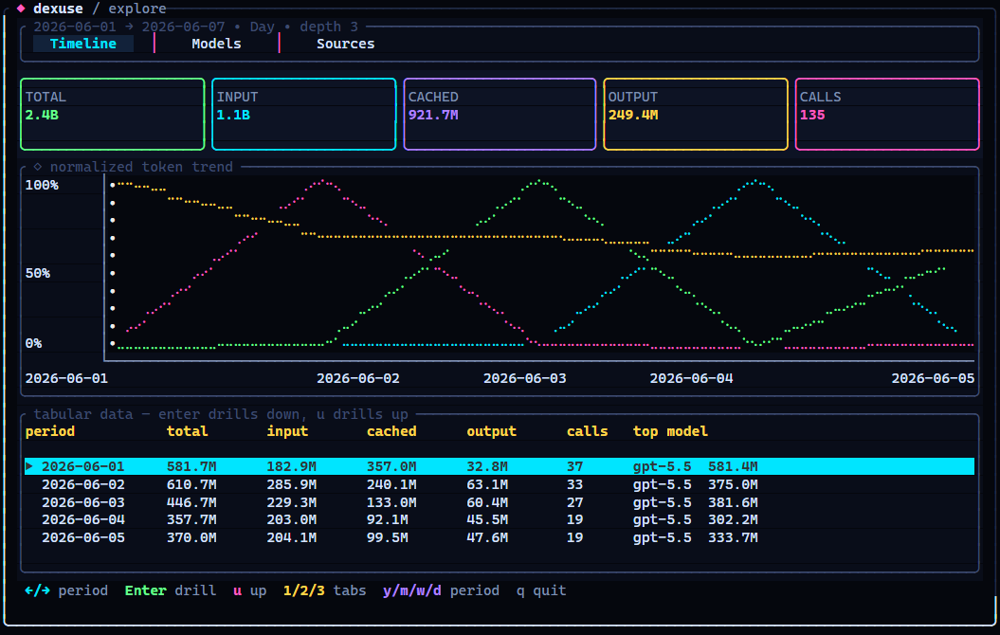
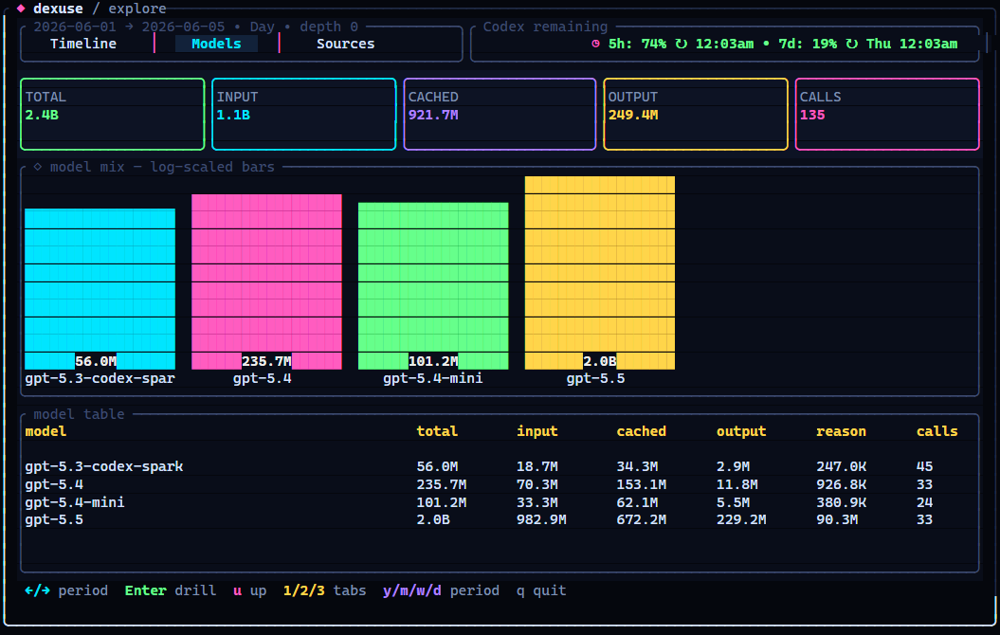
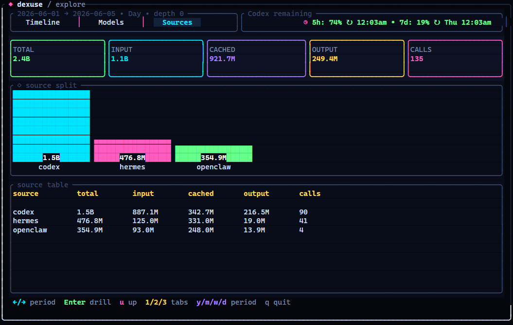

<div align="center">

# dexuse


**OpenAI / Codex token usage, finally visible.**

`dexuse` turns local OpenAI/Codex-style usage history into a polished terminal dashboard with timelines, model splits, source breakdowns, cache reads, reasoning tokens, and JSON export.

[](https://www.rust-lang.org/) [](#screenshots) [](#one-liner)

</div>

## Why it exists

OpenAI/Codex tools leave token history scattered around your machine. `dexuse` pulls the useful parts into one beautiful local view so you can answer:

- Which model burned the most tokens?
- How much was cached instead of fresh input?
- Did it come from Codex, Hermes, or OpenClaw?
- What changed by day, week, month, or year?
- Can I get the same totals as JSON? Yep.

No cloud account. No upload. It reads local files only.

## One-liner

```bash
npx @yashau/dexuse
```

From a checkout:

```bash
mise install
mise run bundle
pnpm exec dexuse
```

`mise` is the primary repo tool: it installs the pinned Rust/Node toolchains and owns the repeatable local tasks for formatting, tests, builds, screenshots, package checks, and release-binary bundling. Use the direct `cargo`/`pnpm` commands below only as lower-level fallbacks.

## Handy moves

```bash
npx @yashau/dexuse
npx @yashau/dexuse --json
npx @yashau/dexuse --json --from 2026-06-01 --to 2026-06-06 --granularity day
npx @yashau/dexuse --codex-only
npx @yashau/dexuse --hermes-only
npx @yashau/dexuse --openclaw-only
```

`dexuse` automatically looks in the usual places:

- Codex: `~/.codex`, including archived sessions
- Hermes: `~/.hermes`, `%LOCALAPPDATA%\hermes`, and profile databases
- OpenClaw: `~/.openclaw`, with legacy `~/.clawdbot` fallback

Need a custom path?

```bash
npx @yashau/dexuse --codex-home ~/.codex
npx @yashau/dexuse --hermes-home ~/.hermes
npx @yashau/dexuse --openclaw-home ~/.openclaw
```

## Screenshots

<div align="center">

### Drill into time



### Compare models



### See where the tokens came from



</div>

## Keyboard moves

- `1` / `2` / `3`: Timeline, Models, Sources
- `Tab`, `Shift+Tab`, `[` / `]`: switch tabs
- `←` / `→` or `h` / `l`: move the selected period
- `Enter` / `Space`: drill down through time
- `u` / `Backspace`: go back up
- `y` / `m` / `w` / `d`: year, month, week, day
- `q` / `Esc`: quit

## What it counts

`dexuse` keeps the buckets separate so big cached sessions do not look like fresh input:

- input tokens
- cached input tokens
- cache write tokens
- output tokens
- reasoning tokens
- API calls
- estimated cost when the source provides it

JSON output includes totals, time buckets, model splits, provider splits, and source splits.

## Built for more OpenAI/Codex sources

Codex, Hermes, and OpenClaw are harnesses over local OpenAI/Codex-style usage logs. The ingestion layer is modular, so another compatible local agent can be added without turning `main.rs` into spaghetti. Maintainer details live in [`AGENTS.md`](AGENTS.md).

## Ship it locally

Use `mise` for setup and quality gates:

```bash
mise install
mise run check
mise run screenshots
mise run pack
```

Direct commands work too when you need to debug a single underlying step:

```bash
cargo fmt --check
cargo test
cargo clippy --all-targets --all-features -- -D warnings
cargo build --release
python scripts/bundle_current.py
python scripts/smoke_json.py
pnpm run screenshots
pnpm pack --dry-run
```

## License

MIT.
